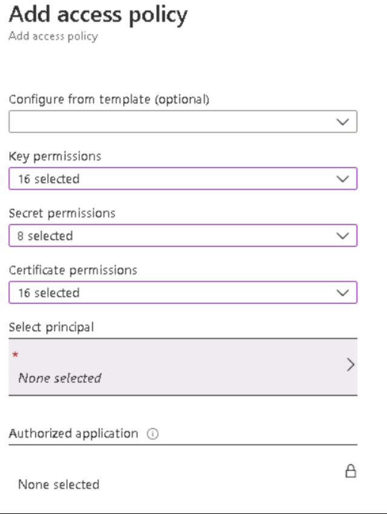

## Exercise 2: Securing the Web Application and database

Duration: 45 minutes

Synopsis: In this exercise, attendees will utilize Azure SQL features to data mask database data and utilize Azure Key Vault to encrypt sensitive columns for users and applications that query the database.

### Task 1: Setup the database

1. Switch to your Azure portal, select **All Services** then search for **SQL Servers**.  Select **SQL Servers**.

    

2. Select the **Azure SQL** database server you created using the Azure Manager template (Ex:  AzureSecurity-INIT).

3. Select **SQL databases** under the Settings section, then select the **SampleDB** database.

    

4. In the summary section, select the **Show database connection strings**.

    

5. Take note of the connection string for later in this lab, specifically the **Server** parameter:

    

6. In the Lab VM, open **SQL Server Management Studio**.

7. Enter the database server name from above.

8. Enter the username and password used from the Azure Template deployment (**wsadmin** - **p!ssword1rocks**).

    > **Note**: If you changed the username and password in the ARM template deployment, use those values instead.

    

9. Depending on how you connected to the Azure SQL environment (inside or outside your vnet), you may be prompted to add a firewall rule. If this occurs, perform the following actions:

    - Select **Connect**, in the **New Firewall Rule** dialog, select **Sign In**.

    - Sign in with your resource group owner credentials.

    - In the dialog, select **OK**, notice how your incoming public IP address will be added for connection.

    

10. Right-click **Databases**, and select **Import Data-tier Application**.

    

    

11. In the Introduction dialog, select **Next**.

12. Select **Browse**, navigate to the extracted **/Hands-on- lab/Database** directory, and select the **Insurance.bacpac** file.

    

13. Select **Open**.

14. On the **Import Settings** dialog, select **Next**.

15. On the **Database Settings** dialog, select **Next**.

    > **Note**: If you get an error, close and re-open SQL Management Studio try the import again. If that does not work, you may need to download the latest SQL Management Studio from [here](https://docs.microsoft.com/en-us/sql/ssms/download-sql-server-management-studio-ssms?view=sql-server-2017). In some instances, the latest version may not work, version 17.3 is known to deploy the package properly.  You should also be aware that bacpac files exported from some SQL Server instances cannot be deployed to Azure SQL Servers.  We have also included a .bak file of the Insurance database that you can use to restore from.

16. Select **Finish** and the database will deploy to Azure. It may take a few minutes.

17. Once completed, select **Close**.

    

18. In **SQL Management Studio**, select **File-\>Open-\>File**.

    

19. Browse to the extracted GitHub folder, select the **\\Hands-on lab\\Database\\00\_CreateLogin.sql** file.

20. Ensure that the **master** database is selected.

21. Run the script to create a login called **agent**.

22. Browse to the extracted folder, select the **\\Hands-on lab\\Database\\01\_CreateUser.sql** file.

23. Ensure that the **Insurance** database is selected.

24. Run the script to create a non-admin user called **agent**.

### Task 2: Test the web application solution

1. In the extracted directory, double-click the **\\Hands-on lab\\WebApp\\InsuranceAPI\\InsuranceAPI.sln** solution file, and Visual Studio will open.

    > **Note**: If prompted, login using your Azure / MSDN account.

2. In the **Solution Explorer**, navigate to and double-click the **Web.config** file to open it.

    

3. Update the web.config (line 77) to point to the **Insurance** database created in Task 2. You should only need to update the server name to point to your Azure SQL Server.

    

4. Press **F5** to run the **InsuranceAPI** solution.

    > **Note**: If you get an CSC error, right-click the project, select **Clean**.  Next, right-click the project and select **Rebuild**.

5. Test the API for a response by browsing to `http://localhost:24448/api/Users`. Your port number may be different from _24448_. You should see several records returned to the browser. Copy a `UserId` value for the next instruction.

    

6. In the browser window that opens, browse to `http://localhost:24448/api/Users/e91019da-26c8-b201-1385-0011f6c365e9` you should see a json response that shows an unmasked SSN column.

    > **Note**: Depending on your browser, you may need to download to view the json response.

   

### Task 3: Utilize data masking

1. Switch to the Azure Portal.

2. Select **SQL databases**.

3. Select the **Insurance** database.

4. Under **Security**, select **Dynamic Data Masking**, then select **+Add Mask**.

    

5. Select the **User** table.

6. Select the **SSN** column.

7. Select **Add**.

    

8. Select **Save**, then select **OK**.

9. Switch back to your InsuranceAPI solution, press **F5** to refresh the page. You should see the SSN column is now masked with **xxxx**.

    

10. Close **Visual Studio**.

### Task 4: Utilize column encryption with Azure Key Vault

1. Switch to **SQL Management Studio**.

2. Select **File->Open->File**, then open the **02\_PermissionSetup.sql** file.

3. Switch to the **Insurance** database, and execute the SQL statement.

4. In the **Object Explorer**, expand the **Insurance** node.

5. Expand the **Tables** node.

6. Expand the **User** table node.

7. Expand the **Columns** node.

8. Right-click the **SSN** column, and select **Encrypt Column**.

    

    Notice that the State of the column is such that you cannot add encryption (data masking):

    

9. Select **Cancel**.

10. Switch back to the Azure Portal, and select the User_SSN data masking.

11. Select **Delete**.

    

12. Select **Save**.

13. Switch back to **SQL Management Studio**.

14. Right-click the **SSN** column, and select **Encrypt Column**.

15. Check the checkbox next to the **SSN** column.

16. For the **Encryption Type**, and select **Deterministic**.

    

    > **Deterministic** encryption always generates the same encrypted value for any given plain text value. Using deterministic encryption allows point lookups, equality joins, grouping and indexing on encrypted columns. However, it may also allow unauthorized users to guess information about encrypted values by examining patterns in the encrypted column, especially if there's a small set of possible encrypted values, such as True/False, or North/South/East/West region. Deterministic encryption must use a column collation with a binary2 sort order for character columns.

    > **Randomized** encryption uses a method that encrypts data in a less predictable manner. Randomized encryption is more secure, but prevents searching, grouping, indexing, and joining on encrypted columns.

17. Select **Next**.

18. For the encryption select **Azure Key Vault** in the dialog.

    

19. Select **Sign In**.

20. Sign in with your Azure Portal credentials.

21. Select your Azure Key Vault.

22. Select **Next**.

23. On the **Run Settings**, select **Next**.

24. Select **Finish**, and the configured will start.

    > **Note**: You may receive a "Wrap Key" error. If so, ensure that your account has been assigned the **wrapKey** permission in the Azure Key Vault.

    

    - Select **Key vault**.

    - Select your key vault.

    - Select **Access policies**.

    - Select **Add New**.

    - Select **Key permissions**, and choose **Select all**.

        

    - Select **Secret permissions**, and choose **Select all**.

    - Select **Certificate permissions**, and choose **Select all**.
    
     - To select your service principal account, click on **None selected**.
    
         

    - In **Select a principal** pane, select your account and then click on **select**.
    
          
    
    - Select **Add**.

    - Select **Save**.

    - Retry the operation.

    > **Note**: If you are still getting errors (such as Access Denied), ensure that you have selected the correct subscription and Key Vault.

    

25. Select **Close**.

26. Right-click the **User** table, and choose **Select top 1000 rows**.

    

    You will notice the SSN column is encrypted based on the new Azure Key Vault key.

    

27. Switch to the Azure Portal.

28. Select **Key Vaults**.

29. Select your Azure Key Vault, and then select **Keys**. You should see the key created from the SQL Management Studio displayed:

    
