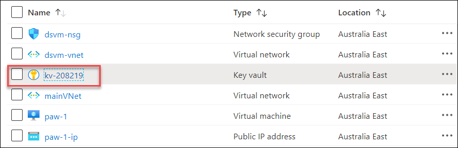
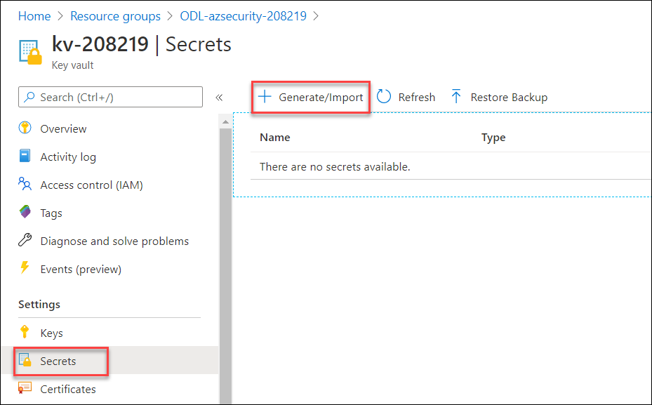
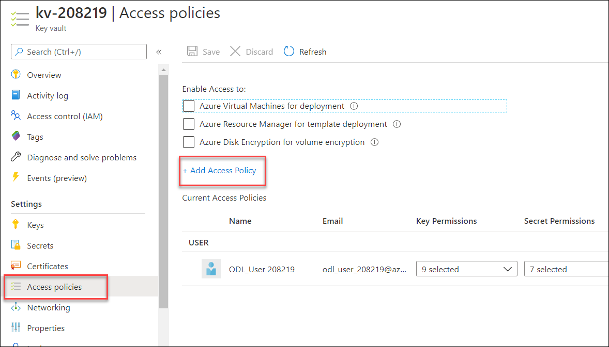

## Exercise 3: Migrating to Azure Key Vault

Duration: 30 minutes

Synopsis: In this exercise, attendees will learn how to migrate web application to utilize Azure Key Vault rather than storing valuable credentials (such as connection strings) in application configuration files.

### Task 1: Create an Azure Key Vault secret

1. Switch to your Azure Portal.

2. Select **Key Vaults**, then select your Azure Key Vault.

    

3. Select **Secrets**, then select **+Generate/Import**.

    

4. For the **Upload Options**, select **Manual**.

5. For the **Name**, enter **InsuranceAPI**.

6. For the **Value,** copy the connection string information from the **InsuranceAPI** solution Web.config file in Exercise 2.

7. Select **Create**.

8. Select **Secrets**.

9. Select **InsuranceAPI**.

10. Select the current version.

    

11. Copy and record the secret identifier URL for later use:

    

### Task 2: Create an Azure Active Directory application

1. In the Azure Portal, select **Azure Active Directory**, then select **App Registrations**.

    

2. Select **+New application registration**.

3. For the user-facing display name, type **AzureKeyVaultTest**.

4. For the supported accounts, select **Accounts in this organization directory only...**

5. For the Redirect URL, type <http://localhost:12345>.

    

6. Select **Register**.

7. Copy and record the **Application ID** for later use.

    

8. In the left menu pane, under the **Manage** heading, select **Certificates and secrets** link.

9. Under **Client secrets**, select **New client secret**.

    

10. For the description, enter **InsuranceAPI**.

11. For the Expires, select **In 1 year**.

12. Select **Add**.

13. Copy and record the key value for later use.

### Task 3: Assign Azure Active Directory application permissions

1. Switch back to Azure Portal and select your Azure Key Vault.

2. Under the **Settings** heading, select **Access Policies**.

3. Select **+ Add Access Policy**.

    

4. Select the **Secret permissions** drop-down, check the **Get** and **List** permissions.

    

5. Choose **Select principal** field value. In the right-hand pane, type **AzureKeyVaultTest**. Select the item.

6. Choose the **Select** button at the bottom.

    Your selection summary should look like this.
    
     <br/>

7. Select **Add** button.

8. Select **Save** button at the top.


### Task 4: Install or verify NuGet Package

1. Close the previous Visual Studio solution, then from the extracted GitHub directory, open the **\\Hands-on lab\\WebApp\\InsuranceAPI\_KeyVault\\InsuranceAPI.sln** solution.

    >**Note**:  Be sure you re-open the correct solution.

    

2. Switch to **Visual Studio**.

3. In the menu, select **View-\>Other Windows-\>Package Manager Console**.

4. In the new window that opens, run the following commands:

    ```PowerShell
    Install-Package Microsoft.CodeDom.Providers.DotNetCompilerPlatform
    ```

    ```PowerShell
    Install-Package Microsoft.IdentityModel.Clients.ActiveDirectory -Version 2.16.204221202
    ```

    ```PowerShell
    Install-Package Microsoft.Azure.KeyVault
    ```

    > **Note**: These already exist in the project but are provided as a reference. If you receive a codedom version error when you debug, run this command.

    ```PowerShell
    Update-Package Microsoft.CodeDom.Providers.DotNetCompilerPlatform -r
    ```

5. From **Solution Explorer**, double-click the **Web.config** file to open it.

    Notice the **appSettings** section has some token values:

    

6. Replace the **ApplicationId** (**ClientId**) and **ClientSecret** with the values from Task 2.

    

7. Replace the **SecretUri** with the Azure Key Vault secret key Uri from Task 1.

8. Save the Web.config file in Visual Studio.

    > **Note**:  You can take this lab a step further and publish the Web App to an Azure App Service  and enable [System-assigned Managed Identities](https://docs.microsoft.com/en-us/azure/app-service/overview-managed-identity?tabs=dotnet).  This will allow you to completely remove any authentication from your configurations and utilize [Key Vault references](https://docs.microsoft.com/en-us/azure/app-service/app-service-key-vault-references).

### Task 5: Test the solution

1. Open the **Web.config**, and comment out or delete the **connectionString** from the file at line 78.

2. Open the **Global.asax.cs** file, and place a break point at line 28.

    > **Note**: This code makes a call to get an accessToken as the application you set up above, then make a call to the Azure Key Vault using that accessToken.

3. Press **F5** to run the solution.

    You should see that you execute a call to Azure Key Vault and get back the secret (which in this case is the connection string to the Azure Database).

    

4. Press **F5** to continue the program.

5. Navigate to [http://localhost:portno/api/Users](http://localhost:portno/api/Users), you should get an error. Because you encrypted the column in the previous exercise, EntityFramework is not able to retrieve the value(s) using default settings. In order to do seamless decryption, you would need to:

    - Run the **\\Hands-on lab\\Database\\02\_PermissionSetup.sql** script if you have not already done so.

    - Add the [AzureKeyVaultProvider for Entity Framework](https://blogs.msdn.microsoft.com/sqlsecurity/2015/11/10/using-the-azure-key-vault-key-store-provider-for-always-encrypted/) reference to the project.

    - Register the provider code in order for .NET to handle the encrypted column.
  
    - Add an access policy to the Azure Key Vault that gives key permissions (`decrypt`, `sign`, `get`, `unwrapkey`, `verify`) to the Azure AD application.

    - Add the `Column Encryption Setting=Enabled` to the connection string.

    - Detailed steps can be found in this [blog post](https://docs.microsoft.com/en-us/archive/blogs/sqlsecurity/using-the-azure-key-vault-key-store-provider-for-always-encrypted)

    - A third solution (**\\Hands-on lab\\WebApp\\InsuranceAPI\_KeyVault\_Encrypted\\InsuranceAPI.sln**) was added to the GitHub repo that has the necessary references and code added.  
  
      - Simply update the web.config file with your client id and secret after adding the required Key Vault permissions above.
  
      - Update the Key Vault connection string to have the `Column Encryption Setting=Enabled`.

      - Review the code added to the global.asax.cs file.

      - Run the project and navigate to the above page.
